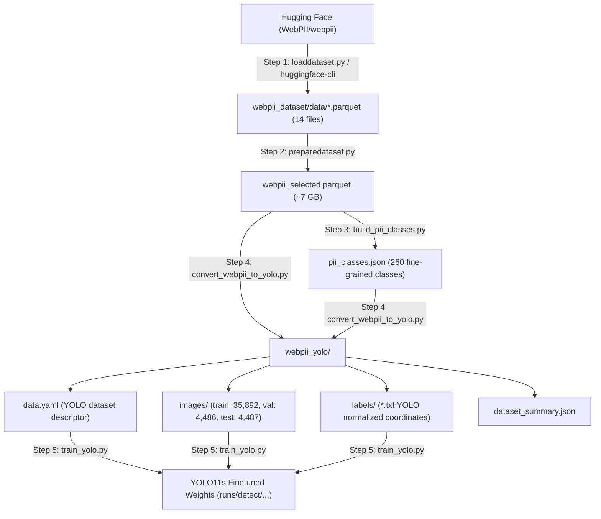

# WebPII Dataset to YOLO Pipeline Guide

Complete step-by-step documentation for downloading the **WebPII** dataset, preprocessing annotations, generating the class taxonomy, and transforming raw parquet files into a verified, high-performance YOLO-trainable object detection dataset using the scripts in this workspace.

---

## 📋 Table of Contents
1. [Pipeline Overview & Directory Architecture](#1-pipeline-overview--directory-architecture)
2. [Environment & Dependencies](#2-environment--dependencies)
3. [Step 1: Download the WebPII Dataset](#3-step-1-download-the-webpii-dataset)
4. [Step 2: Inspect & Merge Parquet Files](#4-step-2-inspect--merge-parquet-files)
5. [Step 3: Extract & Build PII Class Taxonomy](#5-step-3-extract--build-pii-class-taxonomy)
6. [Step 4: Convert to YOLO Detection Format](#6-step-4-convert-to-yolo-detection-format)
7. [Step 5: Validate & Train with YOLO11](#7-step-5-validate--train-with-yolo11)
8. [Script Reference & Command Cheat Sheet](#8-script-reference--command-cheat-sheet)

---

## 1. Pipeline Overview & Directory Architecture



### Directory Structure
```text
D:\web-pii-detector\
├── webpii_dataset\               # Downloaded raw dataset from Hugging Face
│   └── data\                     # 12 train + 2 test parquet files
│       ├── train-00000-of-00012.parquet ...
│       └── test-00000-of-00002.parquet ...
├── webpii_selected.parquet       # Merged parquet dataset with selected columns
├── pii_classes.json              # 260 fine-grained PII class mapping
├── webpii_to_yolo_mapping.json   # 24 grouped high-level class taxonomy mapping
├── webpii_yolo\                  # Final YOLO-trainable format
│   ├── data.yaml                 # YOLO configuration file
│   ├── dataset_summary.json      # Distribution stats & bounding box counts
│   ├── images\                   # train (80%), val (10%), test (10%)
│   └── labels\                   # train (80%), val (10%), test (10%)
├── loaddataset.py                # Hugging Face download script
├── inspect_webpii.py             # Schema and sample inspection script
├── preparedataset.py             # Parquet merger & column filter
├── build_pii_classes.py          # Class taxonomy extractor
├── convert_webpii_to_yolo.py     # Main YOLO dataset conversion engine
└── train_yolo.py                 # Ultralytics YOLO11s training script
```

---

## 2. Environment & Dependencies

Activate the project Python virtual environment before running any script:

```powershell
# In PowerShell (run inside D:\web-pii-detector)
.\venv\Scripts\Activate.ps1
```

If setting up a new environment, install the required packages:
```powershell
pip install huggingface_hub datasets pandas pyarrow pillow ultralytics pyyaml
```

---

## 3. Step 1: Download the WebPII Dataset

The WebPII dataset contains **44,865** annotated web page screenshots (40,384 train, 4,481 test) with bounding boxes around personal identifiable information (emails, names, credit card numbers, addresses, phone numbers, avatars, etc.).

### Option A: Using the Python Script (`loaddataset.py`)
Run [loaddataset.py](file:///d:/web-pii-detector/loaddataset.py):
```powershell
python loaddataset.py
```
> [!NOTE]
> `os.environ["HF_HUB_DISABLE_XET"] = "1"` is set to avoid CAS reconstruction errors when downloading large files through Hugging Face Hub.

### Option B: Using the Hugging Face CLI (Direct to local folder)
To download the parquet files directly into `D:\web-pii-detector\webpii_dataset`:
```powershell
huggingface-cli download WebPII/webpii --repo-type dataset --local-dir D:\web-pii-detector\webpii_dataset
```
This produces 14 Parquet files in `D:\web-pii-detector\webpii_dataset\data\`:
- `train-00000-of-00012.parquet` through `train-00011-of-00012.parquet`
- `test-00000-of-00002.parquet` through `test-00001-of-00002.parquet`

---

## 4. Step 2: Inspect & Merge Parquet Files

### 4.1. Quick Inspection
Run [inspect_webpii.py](file:///d:/web-pii-detector/inspect_webpii.py) to check image dimensions, column schema, and sample annotation format:
```powershell
python inspect_webpii.py
```

### 4.2. Merge into Filtered Parquet (`preparedataset.py`)
The raw parquet files contain metadata fields not strictly needed for vision models. [preparedataset.py](file:///d:/web-pii-detector/preparedataset.py) extracts only the required columns and merges all 14 splits into a single consolidated file:

- Target columns:
  - `image`: raw image bytes / struct
  - `pii_elements_json`: JSON string of bounding boxes & keys
  - `image_width`, `image_height`: image pixel dimensions
  - `page_type`: web page template classification
  - `variant`: page rendering variant

Run the script:
```powershell
python preparedataset.py
```
- **Input:** `D:\web-pii-detector\webpii_dataset\data\*.parquet`
- **Output:** `D:\web-pii-detector\webpii_selected.parquet` (~6.98 GB, 44,865 rows)

---

## 5. Step 3: Extract & Build PII Class Taxonomy

WebPII annotations contain fine-grained entity types (e.g. `PII_CARD_NUMBER`, `PII_EMAIL`, `PII_FULLNAME`, `PII_STREET`, etc.).

Run [build_pii_classes.py](file:///d:/web-pii-detector/build_pii_classes.py):
```powershell
python build_pii_classes.py
```

### How it works:
1. Memory-efficient batch streaming: Reads **only** the `pii_elements_json` column using `pyarrow.parquet.ParquetFile.iter_batches()`, avoiding loading multi-gigabyte image bytes into RAM.
2. Extracts and deduplicates every unique `key` from the JSON structures.
3. Assigns index `0` to `BACKGROUND`, and sorts the remaining classes alphabetically.
4. Generates [pii_classes.json](file:///d:/web-pii-detector/pii_classes.json) containing `class_names` (260 total classes) and `class_to_id`.

> [!TIP]
> If you want a 24-class grouped taxonomy (e.g., merging `PII_FIRSTNAME`, `PII_LASTNAME` into `NAME`), [webpii_to_yolo_mapping.json](file:///d:/web-pii-detector/webpii_to_yolo_mapping.json) is available. You can pass either mapping to the converter.

---

## 6. Step 4: Convert to YOLO Detection Format

The core conversion engine is [convert_webpii_to_yolo.py](file:///d:/web-pii-detector/convert_webpii_to_yolo.py). It turns the Parquet dataset into the standard YOLO directory structure.

### 6.1. YOLO Coordinate Normalization
WebPII stores absolute bounding boxes: `[bbox_x, bbox_y, bbox_width, bbox_height]`.  
YOLO requires center-normalized coordinates:
$$\text{x\_center} = \frac{\text{bbox\_x} + \frac{\text{bbox\_width}}{2}}{\text{image\_width}}$$
$$\text{y\_center} = \frac{\text{bbox\_y} + \frac{\text{bbox\_height}}{2}}{\text{image\_height}}$$
$$\text{norm\_width} = \frac{\text{bbox\_width}}{\text{image\_width}}, \quad \text{norm\_height} = \frac{\text{bbox\_height}}{\text{image\_height}}$$

Values are clipped to `[0.0, 1.0]` and degenerate boxes (width or height $\le 0$) are filtered out.

### 6.2. Run the Conversion Command
```powershell
python convert_webpii_to_yolo.py `
  --input D:\web-pii-detector\webpii_selected.parquet `
  --output D:\web-pii-detector\webpii_yolo `
  --classes-mapping D:\web-pii-detector\pii_classes.json `
  --train-ratio 0.80 `
  --val-ratio 0.10 `
  --test-ratio 0.10 `
  --seed 42 `
  --batch-size 256 `
  --image-format PNG `
  --verify-samples 5
```

### 6.3. Output Results in `webpii_yolo/`:
- **Images:**
  - `images/train/` (35,892 images)
  - `images/val/` (4,486 images)
  - `images/test/` (4,487 images)
- **Labels:** Matching `.txt` files containing `<class_id> <x_center> <y_center> <width> <height>` per line.
- **Dataset Configuration:** [webpii_yolo/data.yaml](file:///d:/web-pii-detector/webpii_yolo/data.yaml) with paths and class names.
- **Summary:** [webpii_yolo/dataset_summary.json](file:///d:/web-pii-detector/webpii_yolo/dataset_summary.json) logging 522,277 total annotations across all classes.

---

## 7. Step 5: Validate & Train with YOLO11

With the YOLO dataset in place, launch training using [train_yolo.py](file:///d:/web-pii-detector/train_yolo.py).

```powershell
python train_yolo.py
```

### Key Training Configurations in `train_yolo.py`:
- **Model Checkpoint:** `yolo11s.pt` (or local weights `D:\models\yolo11s\yolo11s.pt`)
- **Image Resolution:** `imgsz=1024` (preserves fine-grained text, postal codes, and digits)
- **Optimizer:** `AdamW` with cosine decay (`cos_lr=True`) for 260 fine-grained classes
- **Web UI Screenshot Augmentations:**
  - `degrees=0.0`, `shear=0.0`, `perspective=0.0` (web text is strictly horizontal)
  - `flipud=0.0`, `fliplr=0.0` (preserves left-to-right reading order)
  - `mosaic=1.0` (with `close_mosaic=10` in final epochs for clean boundary localization)
  - `box=7.5` (high weight for pixel-level bounding box precision)
- **Evaluation:** Evaluates mAP50 and mAP50-95 on the independent `test` split upon completion.

---

## 8. Script Reference & Command Cheat Sheet

| Step | Goal | Script / Command | Primary Input | Primary Output |
|:---|:---|:---|:---|:---|
| **1** | Download WebPII | `python loaddataset.py` or `huggingface-cli` | HF Repository | `webpii_dataset/data/*.parquet` |
| **2** | Check Sample Schema | `python inspect_webpii.py` | Sample parquet | Terminal logs |
| **3** | Merge & Filter | `python preparedataset.py` | `webpii_dataset/data/*.parquet` | `webpii_selected.parquet` |
| **4** | Build Class Map | `python build_pii_classes.py` | `webpii_selected.parquet` | `pii_classes.json` |
| **5** | Convert to YOLO | `python convert_webpii_to_yolo.py` | `webpii_selected.parquet` | `webpii_yolo/` (images, labels, data.yaml) |
| **6** | Train YOLO11 | `python train_yolo.py` | `webpii_yolo/data.yaml` | `runs/detect/webpii_yolo11s_high_acc/` |
